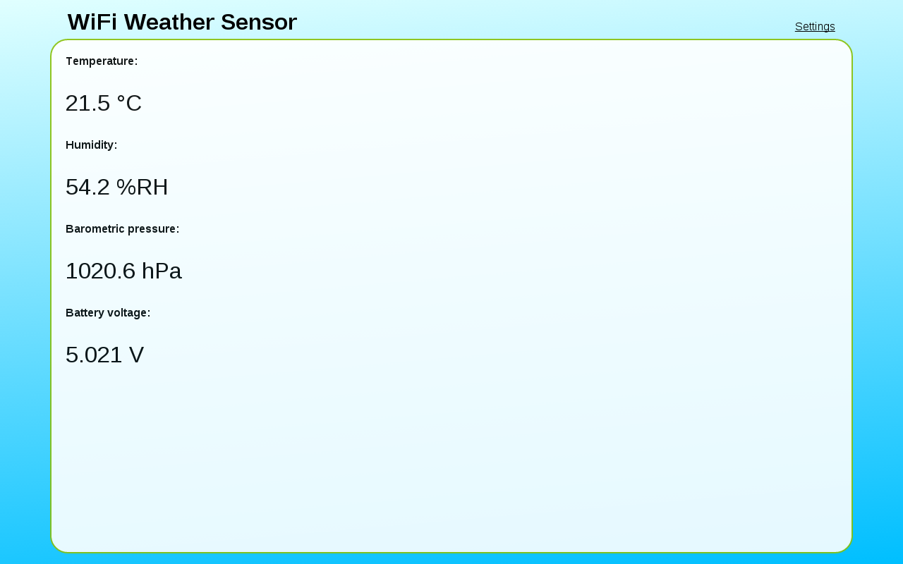
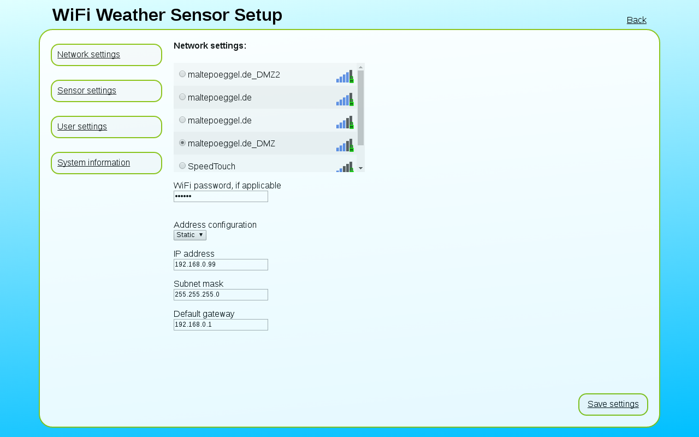
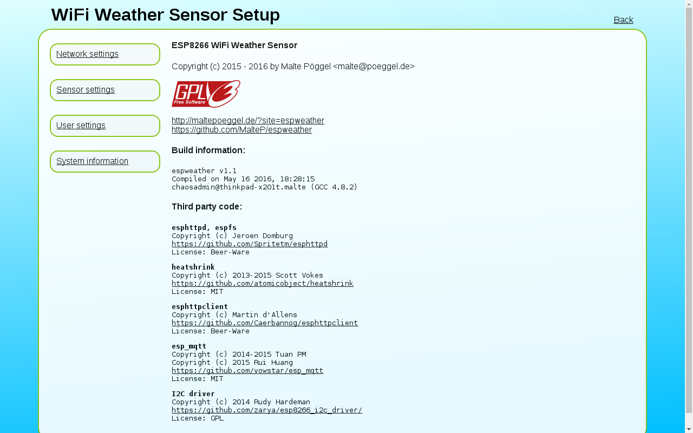

# ESP8266 WiFi Weather Sensor


## Project overview

The WiFi Weather Sensor is a tiny weather station based on the ESP8266 SOC. It will push the measured temperature, humidity, pressure and battery voltage to the cloud or local servers in defined intervals. Configuration is done by using a simple web browser.

The sensor can be powered using a standard USB power supply or any batteries with a voltage of 3.5 to 6.5V. If inactive, the sensor will enter low power standby. A set of four AA batteries e.g. will last for about one month. The system will also switch off if the voltage drops below 3.0V to safe LiPo batteries. For recharging you might combine it with a solar charger.

## Building the hardware

#### Ordering the parts

Most of the components are available from [Reichelt Elektronik](http://www.reichelt.de/), some more specific parts at [Farnell](http://www.farnell.com/), [Mouser](http://www.mouser.com/) or [Digikey](http://www.digikey.com/). For the ESP-12 (PCB antenna only) or ESP-07 module (PCB antenna + U.FL connector) have a look at [eBay](http://www.ebay.com/) or [Aliexpress](http://www.aliexpress.com/).

As temperature / humidity sensor either SHT11/SHT15 (more accurate) or AM2302/DHT22 (lower price) are possible. The connected sensor is detected automatically. Barometric pressure is measured by using the MS5637 sensor. (Or BMP180 on v1 circuit board)

Here's a list of all components: [Bill of materials (PDF)](documents/parts_v2.pdf)

#### Circuit board

The circuit board is double-sided and plated-through. Because of that i'll recommend ordering it from a PCB manufacturer. Gerber files are included in the GIT repository. Possible good value PCB fabs are [OSH-Park (USA)](http://www.oshpark.com/), [Itead-Studio (China)](http://www.itead.cc/open-pcb.html) or [Dirty Cheap Circuit Boards (China)](http://www.dirtypcbs.com/).

The design is already uploaded to OSH Park, just order it here:

[WiFi Weather Sensor (Version 2) Circuit Board](http://www.oshpark.com/shared_projects/pmVMF4gY)

[WiFi Weather Sensor (Version 1 rev. D) Circuit Board](http://www.oshpark.com/shared_projects/jZi4VgjG)

#### Schematic

[](documents/schematic_v2.pdf)

The LDO IC3 regulates the battery voltage down to 3.3V for power supply of the whole system. Battery voltage is monitored through the voltage divider R7 / R8 which is switched on by FET T2 only during measurement [to reduce power consumption](http://www.jeelabs.org/2013/05/18/zero-power-measurement-part-2/). The barometric pressure sensor MS5637 (IC4) and temperature / humidity sensor SHT11 (IC5) are connected to the ESP8266 module IC2 via I²C bus. Alternatively the temperature / humidity sensor AM2302/DHT22 (IC1) can be used. It is connected using a single wire bus. Status LED (D2) and a setup button (S1) are connected directly to the WiFi module. R3 is used as pull-up resistor for the button, R2 for the reset pin. In low power standby mode XPD_DCDC (GPIO16) is pulled low on wakeup timer event. I've connected it to the reset pin through a shottky diode (D1), because otherwise GPIO16 seemed to be at high level and there was a few ten milliamps of current flowing during reset if flashed via serial connection.

#### Assembling the board

The top side (except for the SHT11 sensor) is soldered in a reflow oven. Just apply solder paste through a CNC cut stencil and bake the board with the appropriate temperature profile. If you don't own a reflow oven, a hot air soldering station might work, too.

The bottom side is assembled using a conventional soldering iron. It's the best practice to start with the smallest components first. If the sensor should run on batteries, don't forget to remove the red LED from the ESP8266 module.

## Preparing the hardware to flash

All ESP8266 modules have a pre-installed bootloader which allows simple firmware flashing via serial connection. A 3.3V TTL USB serial adapter is needed. I recommend those with FT232 chipset.

Connect the pin header of the board to the serial adapter as follows:

| Weather sensor | Serial adapter |
| -------------- | -------------- |
| TXD            | TXD            |
| RXD            | RXD            |
| RST            | RTS            |
| GP0            | DTR            |
| GND            | GND            |

## Building the firmware

If you don't want to modify the firmware, you might skip the next steps and [flash the precompiled firmware](#flashing-the-precompiled-firmware).

#### Installing the toolchain

First we will install all necessary packages to compile the toolchain. On a minimal Fedora 23 Linux use the following commands:

```
sudo dnf install make autoconf automake libtool gcc gcc-c++ gperf flex bison texinfo gawk ncurses-devel expat-devel python pyserial python-devel sed git unzip wget bzip2 patch help2man

sudo dnf install http://download1.rpmfusion.org/free/fedora/rpmfusion-free-release-$(rpm -E %fedora).noarch.rpm 
sudo dnf install http://download1.rpmfusion.org/nonfree/fedora/rpmfusion-nonfree-release-$(rpm -E %fedora).noarch.rpm
sudo dnf install unrar
```

Now we're ready to download and compile the ESP8266 toolchain. This process may take a few minutes, depending on your Internet connection and CPU speed, so you better get yourself a cup of tea (or coffee).

```
git clone --recursive https://github.com/pfalcon/esp-open-sdk.git

cd esp-open-sdk
make

cd ..
```

If no errors have occurred, we are ready to finish the installation. I prefer moving the toolchain out of my home directory to /opt, but you may also leave it there and change the paths in the environment variables.

```
sudo mv esp-open-sdk /opt/esp-open-sdk
```

Open your `.bashrc` file with your favorite editor and add the following lines at the end of the file:

```
export PATH=/opt/esp-open-sdk/xtensa-lx106-elf/bin:$PATH
export XTENSA_TOOLS_ROOT=/opt/esp-open-sdk/xtensa-lx106-elf/bin/
export SDK_BASE=/opt/esp-open-sdk/sdk
export ESPTOOL=/opt/esp-open-sdk/esptool/esptool.py
export ESPPORT=/dev/ttyUSB0
```

The changes take effect after a new shell is opened, so log out or open a new terminal window.

#### Installing yui-compressor

yui-compressor is written in Java, so we'll need to install the Java package:

```
sudo dnf install java
```

Now download the precompiled .jar file to a folder and also copy it to /opt:

```
mkdir yuicompressor
wget https://github.com/yui/yuicompressor/releases/download/v2.4.8/yuicompressor-2.4.8.jar
mv yuicompressor-2.4.8.jar yuicompressor/yuicompressor.jar
sudo mv yuicompressor /opt/yuicompressor
```

A small wrapper script is needed to execute `yui-compressor` from the `makefile`. Open it with your favorite editor by typing:

```
sudo vi /usr/bin/yui-compressor
```

And add the following lines:

```
#!/bin/sh
java -jar /opt/yuicompressor/yuicompressor.jar $*
```

Now make the script executable:

```
sudo chmod +x /usr/bin/yui-compressor
```

#### Compiling the firmware

Just clone this repository and change into its directory:

```
git clone https://github.com/MalteP/espweather.git
cd espweather
cd firmware
```

Compile the firmware by typing `make`.

```
make
```

Flash firmware and filesystem partition by typing:

```
make flash
make htmlflash
```

If the serial port is not /dev/ttyUSB0, you may add (for example) `ESPPORT=/dev/ttyUSB1` to both `make` commands or change your environment variables.

If the firmware is running, the orange LED on the board should start flashing.

## Flashing the precompiled firmware

If you don't want to compile the firmware yourself, just skip all "[Building the firmware](#building-the-firmware)" steps above.

You might use [NodeMCU Flasher](https://github.com/nodemcu/nodemcu-flasher) on Windows to flash the precompiled binaries. Open it, change to the "Config" tab and choose the firmware binary by clicking the gear-wheel button. Click the drop-down list on the right side to select the flash section 0x00000. Change back to the "Operation" tab, select the COM port your serial adapter is connected to, and click the "Flash" button.


## Hardware setup

There are two modes inside the firmware, normal mode and configuration mode. In normal mode the sensor will measure and push data to the cloud. In configuration mode the sensor acts as wireless access point and is configured via a standard web browser.

#### Normal mode

The sensor will measure temperature, humidity, barometric pressure and battery voltage and push these values to the configured server. After that it will enter deep sleep standby.
At the first start after the battery has been connected, the sensor will stay active for one minute. You may press the button for 3-4sec to switch to configuration mode.

The status is shown by the orange LED, flashing in 1s intervals

| no. of flashes | Status                  |
| -------------- | ----------------------- |
| 1x             | Waiting for WiFi / DHCP |
| 2x             | Push data               |
| 3x             | Server error            |
| 4x             | First start, waiting    |

#### Configuration mode



In configuration mode the orange LED will blink at 1Hz clock. Use your computer to connect to the WiFi ESP_xxxx (no encryption) and open http://192.168.4.1/ in your browser.
It will show measured values on the main page, but they may not be very accurate because the WiFi module will heat up the sensors. (This won't affect normal mode because the sensor is only active for ~20sec and will "cool down" during standby periods!)
To leave configuration mode, hold the button for 3-4sec. To erase all configuration data, hold the button for about 10sec.

Click on the button "Settings" at the top right side. The default username is "admin" with password "insecure".

##### Network settings



Just choose the WiFi you want to connect to and enter the password if it is encrypted. 
It might be useful to set up a guest network in your router for security reasons.

##### Sensor settings


On the sensor settings tab, you may change the interval the sensor data is pushed to HTTP and / or MQTT servers. Per default this is set to 300sec (5min).

As cloud services [Thinkspeak](http://www.thingspeak.com/) and [adafruit.io](http://io.adafruit.com/) are available. It is also possible to use a custom URL with placeholders which are replaced by measured values.

| Placeholder | Value              |
| ----------- | ------------------ |
| %t          | Temperature        |
| %h          | rel. Humidity      |
| %p          | Barometic pressure |
| %v          | Battery voltage    |

If you like to use MQTT, just setup a server software like [mosquitto](http://www.mosquitto.org/) and configure host, port, user and password. The sensor will publish data on [topic]/temperature, /humidity, /pressure and /voltage. Different clients may subscribe and receive data immediately after it is published.

##### User settings


You may change the default username and password for configuration login here.

##### System information



This shows some nice information about the sensor and code used.

## License

The firmware is released under the terms of [GNU GPL v3](http://www.gnu.org/licenses/gpl-3.0.en.html), circuit board is licensed [CC BY-NC-SA](https://www.creativecommons.org/licenses/by-nc-sa/3.0/).
